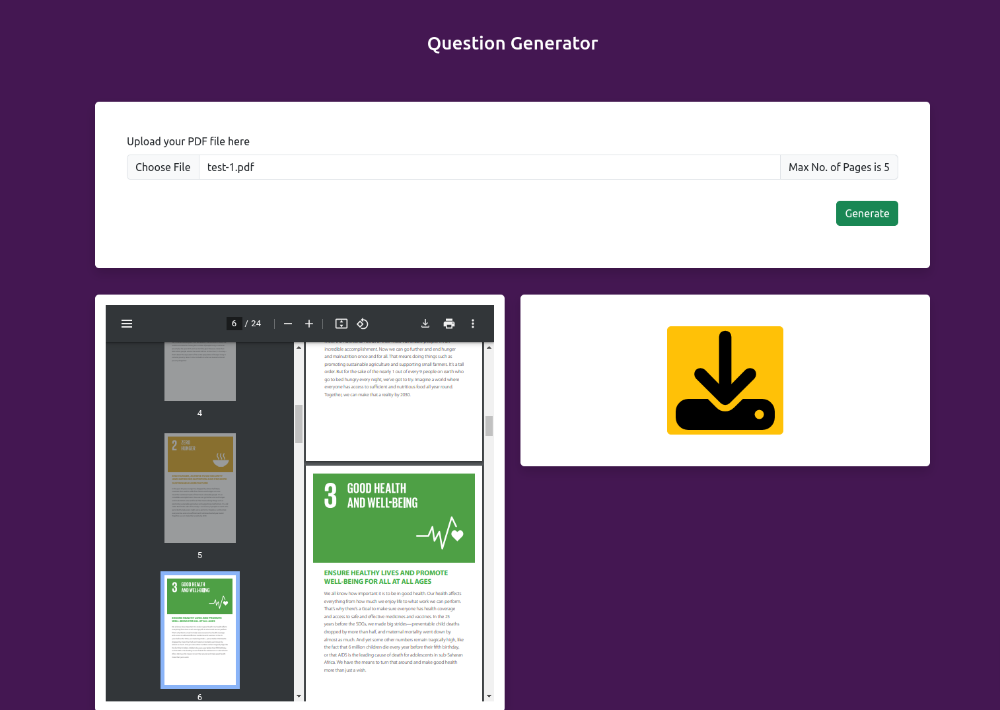

# Question Generator from PDFs using LangChain, OpenAI, FastAPI, and FAISS  

This project is an **AI-powered question generator** that processes PDFs, extracts key information, and generates relevant questions using **LangChain**, **OpenAI**, and **FastAPI**. It enables users to upload documents and automatically create meaningful questions to aid in learning, assessments, or knowledge extraction.  

## 🚀 Features  
- **FastAPI Backend** – Handles file uploads, processing, and API requests efficiently.  
- **FAISS Vector Store** – Stores and retrieves document embeddings for better context understanding.  
- **LangChain Pipeline** – Processes text and structures question generation workflows.  
- **OpenAI API** – Generates high-quality, context-aware questions from the extracted text.  
- **PDF Upload & Parsing** – Supports document uploads, extracts content, and processes information for question generation.  
- **Automated Question Generation** – Converts document content into well-structured questions for assessments and study purposes.  

## 🔧 How It Works  
1. **PDF Upload** – Users upload a PDF, which is parsed to extract textual content.  
2. **Document Processing** – The extracted text is embedded and stored in FAISS for efficient retrieval.  
3. **Question Generation** – LangChain processes the retrieved content and uses OpenAI to generate relevant questions.  
4. **API Response** – The generated questions are returned via a FastAPI endpoint for further use.  

This project is ideal for **educational tools, AI-driven assessments, and knowledge extraction from documents.** 📚🤖🚀  


## 🛠 Installation & Setup  
Before running the application, create a `.env` file from `.env.sample` and you will need to set the following environment variable to your .env file `OPENAI_API_KEY`

1. Clone the repository:  
   ```bash
   git clone https://github.com/smrussel/gemini-pro-rag.git
   cd gemini-pro-rag
    ```
2. Install dependencies:
    ```bash
    pip install -r requirements.txt
    ```
3. Run the chatbot:
    ```bash
    python app.py
    ```

## 📌 Dependencies
    * Python 3.10
    * Fastapi
    * FAISS
    * Openai API
    * Langchain 


## UI Screenshot



## 📜 License
This project is licensed under the [MIT](LICENSE) License.